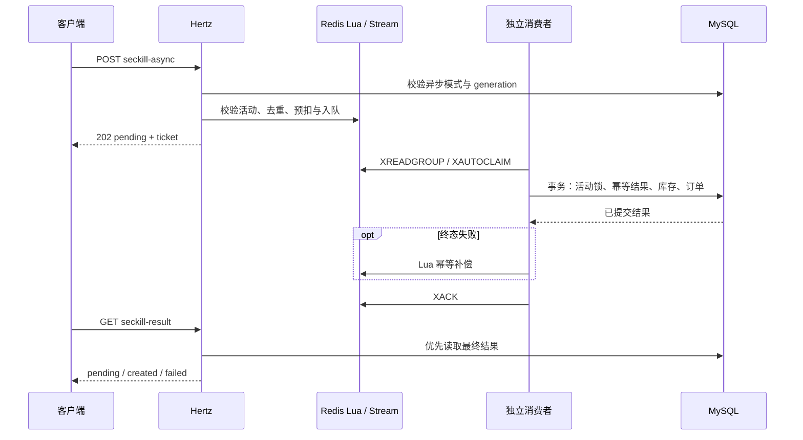

# ADR 007：按活动启用的异步秒杀

状态：已实现。适用于基础同步事务版本之后的优化，不改变默认活动行为。

## 决策

1. **活动写入隔离**：启用命令与同步订单锁同一行；只迁移从未下单的活动，先持久化 immutable generation、初始容量与 initializing 状态，再创建 Redis 快照，最后激活。未激活时不开放受理；已激活后禁止 create-only 初始化被用于补库。
2. **使用已有 Redis Stream**：当前模块化单体无需增加新的消息基础设施。Lua 将库存、去重和入队串行执行；这不等同于 Redis 与 MySQL 的分布式事务。
3. **投递至少一次，副作用幂等**：`(voucher_id,event_id)` 是结果主键，`(voucher_id,generation,user_id)` 和订单的 `(user_id,voucher_id)` 各有唯一约束。事务内活动锁避免同一活动重复消费竞争，订单、库存和结果一起提交。
4. **消费时验证受理时间**：消息的 `accepted_ms` 来自 Redis TIME；以受理时间落在活动窗口内为准，允许活动结束后消费有效消息。MySQL 与 Redis 时钟需正常同步。
5. **提交后确认**：不对暂时数据库错误作终态补偿；终态失败以已提交结果为依据，Lua 使用事件标记只回补一次，再确认消息。进程退出、回复丢失和重复接管均可重试。
6. **独立消费者**：避免依赖 HTTP 请求生命周期，顺序批处理并逐条设置预算；等待退出后再关闭连接池。错误消息不自动删除，正常消息可继续推进。

## 取舍

当前仍逐请求读取活动配置，消费者仍使用活动行锁，目标首先是缩短受理路径、缓冲流量和明确恢复语义。没有声称已提升多少 QPS；SQL 最终落库吞吐仍是容量约束。可以后续批量化或换消息中间件，但必须保留幂等结果、确认时序和库存对账责任。

Redis 数据整体丢失、恢复到较旧快照、运维越过命令直接改库存均不在自动恢复能力内。自动用 SQL 库存重建可能重复发放尚未落库的预留，因此当前选择拒绝受理并要求对账。活动归档与积压告警单独推进。

接口与命令见 [异步秒杀](../api/async-order.md)。机制参考 Redis 官方的 [XAUTOCLAIM](https://redis.io/docs/latest/commands/xautoclaim/) 与 [XACK](https://redis.io/docs/latest/commands/xack/)；确认不会删除 Stream 条目。
